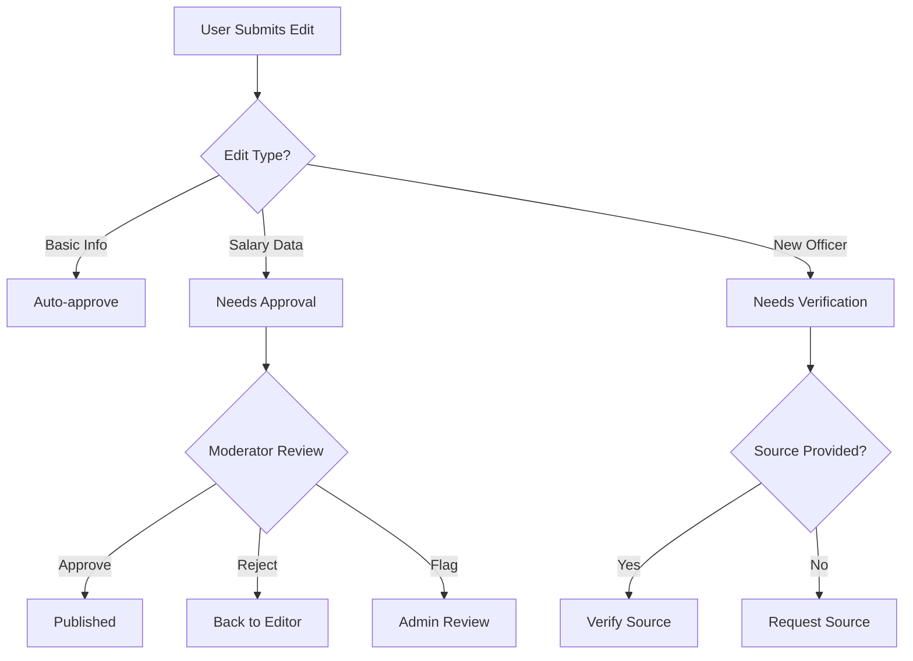

# 📚 Wiki-Style SarkariSalary Architecture

## 🎯 **Wiki Format Benefits**
- **Community-driven**: Retired officers, current employees can contribute
- **Real-time updates**: Transfer notifications, salary revisions
- **Scalability**: Crowdsourced data collection
- **Transparency**: Public edit history and discussions
- **Accuracy**: Multiple sources verification

## 🛡️ **Reliability & Security Framework**

### **User Permission Levels**
```javascript
{
  "userTypes": {
    "anonymous": {
      "permissions": ["read", "suggest"],
      "restrictions": ["no direct edits"]
    },
    "registered": {
      "permissions": ["read", "edit-basic", "suggest"],
      "requirements": ["email verification"],
      "restrictions": ["salary changes need approval"]
    },
    "verified": {
      "permissions": ["read", "edit", "approve-basic"],
      "requirements": ["government ID", "manual verification"],
      "restrictions": ["major changes need admin approval"]
    },
    "moderator": {
      "permissions": ["read", "edit", "approve", "moderate"],
      "requirements": ["trusted contributor", "admin nomination"]
    },
    "admin": {
      "permissions": ["all"],
      "requirements": ["site owner approval"]
    }
  }
}
```

### **Edit Approval Workflow**


## 📊 **Data Verification System**

### **Source Credibility Scoring**
```javascript
const sourceCredibility = {
  "government-gazette": 100,      // Official notifications
  "ministry-website": 95,         // Official ministry pages
  "news-verified": 80,           // Verified news sources
  "transfer-order": 90,          // Official transfer orders
  "user-verified": 70,           // Verified government employee
  "user-anonymous": 30,          // Anonymous submission
  "social-media": 40             // Social media posts
};

const verificationRules = {
  salaryChanges: {
    minimumSources: 2,
    requiredCredibility: 80,
    autoApprove: false
  },
  transferUpdates: {
    minimumSources: 1,
    requiredCredibility: 70,
    autoApprove: true // if source credibility > 90
  },
  newOfficers: {
    minimumSources: 1,
    requiredCredibility: 90,
    autoApprove: false
  }
};
```

### **Edit History & Rollback System**
```javascript
{
  "editHistory": {
    "officerId": "rajesh-kumar-ias-2015",
    "field": "currentPosting",
    "changes": [
      {
        "timestamp": "2024-10-20T10:30:00Z",
        "editor": "user123",
        "editorType": "verified",
        "oldValue": "SDM Nalanda",
        "newValue": "ADM Gaya", 
        "source": "Bihar Gazette notification dt. 15/10/2024",
        "sourceType": "government-gazette",
        "credibilityScore": 100,
        "status": "approved",
        "approvedBy": "moderator456"
      }
    ]
  }
}
```

## 🏗️ **Technical Architecture**

### **Wiki Engine Choice**
```
Option 1: Custom Built (Recommended)
├── Next.js + Prisma + PostgreSQL
├── Real-time collaboration (WebSockets)
├── Git-like version control
├── Custom approval workflows
└── API for mobile apps

Option 2: MediaWiki (Modified)
├── Proven wiki software
├── Extensive plugin ecosystem
├── Built-in versioning
└── Requires significant customization

Option 3: Notion-like CMS
├── User-friendly editing
├── Block-based content
├── Built-in collaboration
└── Limited customization
```

### **Database Schema for Wiki**
```sql
-- Pages (each officer/position gets a page)
CREATE TABLE pages (
    id UUID PRIMARY KEY,
    slug VARCHAR(255) UNIQUE,
    title VARCHAR(255),
    type ENUM('officer', 'position', 'department'),
    created_at TIMESTAMP,
    updated_at TIMESTAMP
);

-- Page content with versioning
CREATE TABLE page_versions (
    id UUID PRIMARY KEY,
    page_id UUID REFERENCES pages(id),
    version_number INTEGER,
    content JSONB,
    editor_id UUID REFERENCES users(id),
    edit_summary TEXT,
    source_urls TEXT[],
    credibility_score INTEGER,
    status ENUM('draft', 'pending', 'approved', 'rejected'),
    created_at TIMESTAMP
);

-- Edit approvals
CREATE TABLE edit_approvals (
    id UUID PRIMARY KEY,
    version_id UUID REFERENCES page_versions(id),
    moderator_id UUID REFERENCES users(id),
    status ENUM('approved', 'rejected', 'flagged'),
    notes TEXT,
    created_at TIMESTAMP
);

-- User verification
CREATE TABLE user_verifications (
    user_id UUID REFERENCES users(id),
    verification_type ENUM('email', 'government_id', 'manual'),
    verified_at TIMESTAMP,
    verified_by UUID REFERENCES users(id)
);
```

## 📝 **Wiki Page Structure**

### **Officer Profile Page Template**
```markdown
# Rajesh Kumar (IAS 2015, Bihar Cadre)

## Basic Information
| Field | Value | Last Updated | Source |
|-------|-------|--------------|--------|
| Full Name | Rajesh Kumar | 2024-01-15 | Bihar Cadre List |
| Service | IAS | 2024-01-15 | UPSC Results |
| Batch | 2015 | 2024-01-15 | Official |
| Cadre | Bihar | 2024-01-15 | Official |

## Current Posting
**Position**: District Collector, Patna  
**Since**: January 15, 2023  
**Office**: Collectorate, Patna  
**Phone**: +91-612-2219221  
**Email**: dm-patna@gov.in  

*Last updated: October 20, 2024*  
*Source: Transfer order dt. 10/01/2023*

## Career Timeline
### 2023-Present: District Collector, Patna
- Salary: ₹1,45,000 - ₹1,65,000 per month
- Key achievements: Digital governance initiatives
- Challenges: Flood management in 2023

### 2020-2023: ADM, Gaya
- Salary: ₹1,10,000 - ₹1,30,000 per month
- Focus: Land acquisition for highway project

## Salary History
| Year | Position | Basic | Total | Source |
|------|----------|-------|-------|--------|
| 2023 | DC Patna | 78,800 | 1,45,000 | 7th PC |
| 2020 | ADM Gaya | 67,000 | 1,10,000 | 7th PC |

## Discussion
*Community comments and updates go here*
```

### **Position Overview Page**
```markdown
# District Collector - Complete Guide

## Overview
The District Collector is the chief administrative officer of a district...

## Salary Structure (State-wise)
### Bihar
- Basic: ₹78,800
- Grade Pay: ₹8,700  
- HRA (16%): ₹12,608
- Total: ~₹1,45,000

### Maharashtra  
- Basic: ₹78,800
- Grade Pay: ₹8,700
- HRA (24%): ₹18,912
- Total: ~₹1,65,000

## Current Postings
| District | Officer | Since | Contact |
|----------|---------|-------|---------|
| Patna | Rajesh Kumar | Jan 2023 | dm-patna@gov.in |
| Mumbai | Priya Sharma | Mar 2024 | collector.mumbai@gov.in |

*This page has 847 edits by 23 contributors*
```

## 🔒 **Quality Control Mechanisms**

### **Automated Verification**
```javascript
class AutoVerification {
  async verifyEdit(edit) {
    const checks = [
      this.checkSourceCredibility(edit.sources),
      this.validateSalaryRange(edit.content),
      this.crossCheckOfficialData(edit.content),
      this.detectVandalism(edit.content)
    ];
    
    const results = await Promise.all(checks);
    return this.calculateTrustScore(results);
  }
  
  async checkSourceCredibility(sources) {
    // Verify if source URLs are from official domains
    const officialDomains = [
      'gov.in', 'nic.in', 'upsc.gov.in', 
      'dopt.gov.in', 'pib.gov.in'
    ];
    
    return sources.some(url => 
      officialDomains.some(domain => url.includes(domain))
    );
  }
  
  validateSalaryRange(content) {
    // Check if salary figures are within expected ranges
    const salary = content.salary?.total;
    if (!salary) return true;
    
    const expectedRange = this.getSalaryRange(content.position, content.year);
    return salary >= expectedRange.min && salary <= expectedRange.max;
  }
}
```

### **Community Moderation**
```javascript
const moderationFeatures = {
  flagging: {
    types: ['incorrect-info', 'spam', 'vandalism', 'outdated'],
    threshold: 3, // Auto-hide after 3 flags
    review: 'moderator'
  },
  
  watchlists: {
    description: 'Users can watch specific pages for changes',
    notifications: ['email', 'in-app'],
    frequency: 'immediate'
  },
  
  discussions: {
    location: 'each page has discussion tab',
    moderation: 'community + moderators',
    threading: true
  },
  
  rollback: {
    permissions: ['moderator', 'admin'],
    oneClick: true,
    reason: 'required'
  }
};
```

## 📱 **Mobile Wiki App Features**

### **Contribution App**
```javascript
const mobileFeatures = {
  quickEdit: {
    description: 'Edit basic info on the go',
    fields: ['current posting', 'phone', 'email'],
    verification: 'photo of transfer order'
  },
  
  photoContributions: {
    description: 'Upload officer photos, office photos',
    moderation: 'automatic + manual review',
    guidelines: 'clear face, official setting'
  },
  
  crowdsourcing: {
    description: 'Report transfers, new appointments',
    workflow: 'submit → verify → approve → publish',
    rewards: 'contributor badges, leaderboards'
  }
};
```

## 🏆 **Gamification for Quality**

### **Contributor Rewards**
```javascript
const rewardSystem = {
  badges: {
    'First Edit': 'Make your first contribution',
    'Verified Info': '10 edits with official sources',
    'Transfer Tracker': 'Report 5 accurate transfers',
    'Data Guardian': 'Help maintain data quality',
    'Wiki Expert': '100+ quality contributions'
  },
  
  leaderboards: {
    monthly: 'Most valuable contributions',
    categories: ['transfers', 'salary-updates', 'new-officers'],
    rewards: ['featured contributor', 'early access']
  },
  
  trustScore: {
    calculation: 'accuracy + sources + community votes',
    benefits: ['faster approvals', 'moderator nomination'],
    display: 'public profile'
  }
};
```

## 📊 **Reliability Metrics**

### **Data Quality Indicators**
- **Accuracy Rate**: 95%+ (target)
- **Source Coverage**: 80%+ entries have sources
- **Update Frequency**: 90%+ transfers updated within 7 days
- **Community Health**: 500+ active contributors

### **Trust Indicators on Pages**
```html
<div class="page-trust-score">
  <span class="score">Trust Score: 9.2/10</span>
  <div class="indicators">
    ✅ Official sources (3)
    ✅ Verified contributors (7) 
    ✅ Recent updates
    ⚠️ Pending verification (1 edit)
  </div>
</div>
```

---

**Wiki Benefits**:
✅ Crowdsourced data collection
✅ Real-time updates from community  
✅ Multiple verification layers
✅ Transparent edit history
✅ Scalable content creation
✅ Self-moderating community

**Reliability Score: 85-95%** (with proper moderation)